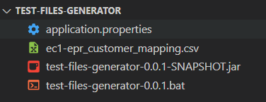
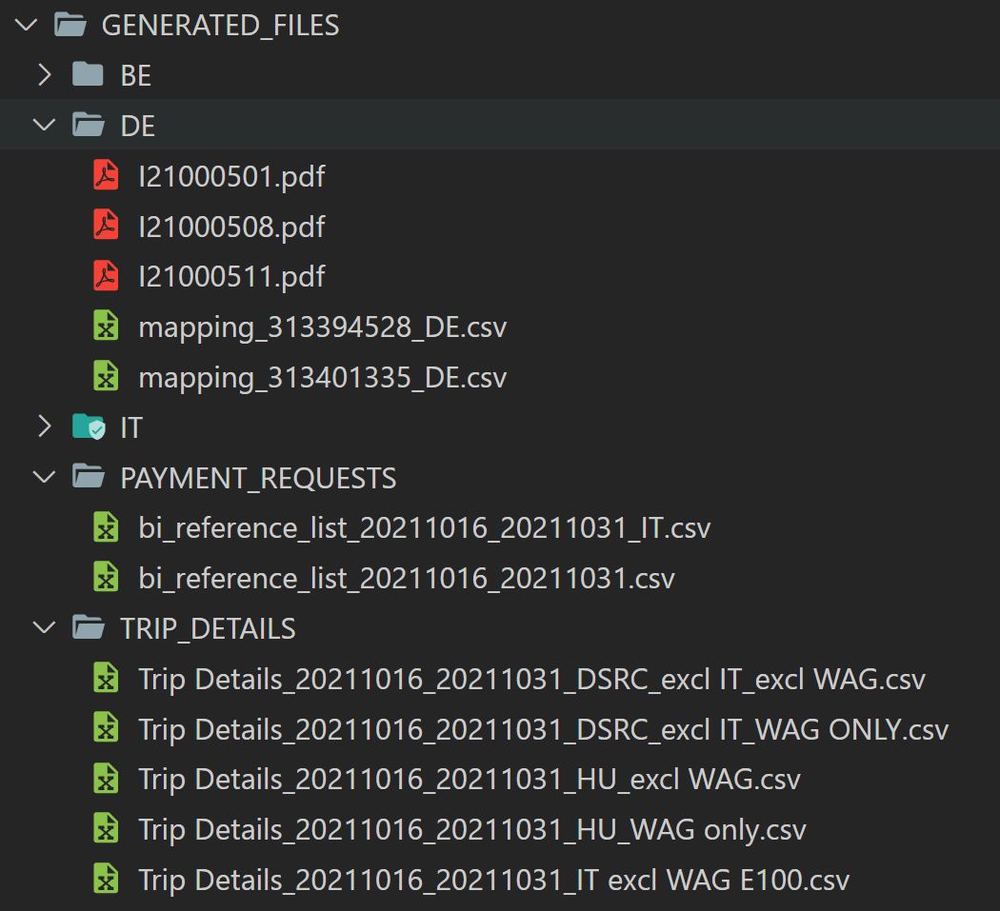
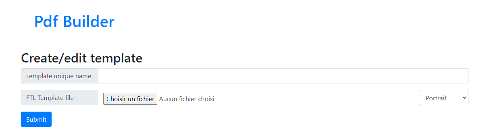

# Reference Documentation
The project is generating test files for Document Hub application.
Sources can be found in this [repository](https://bitbucket.org/DN_Analytics/test-files-generator/src/2fa89f8ad7e2/?at=master).

The program takes invoices, trip details, payment requests in csv format and a mapping csv of EPR ↔︎ EC1 ids, as input.

It updates the customers and sales partners ids (EPR) with the corresponding EC1 ids and create the new csv. If the EPR id is not found in the mapping csv, the line is not added on the new csv.

For the invoices, PDFs are also created using Pdf builder.

## Usage
### Files in of the project

To launch the program click on the .bat script. Csv should be in UTF-8.

You need to have access to Pdf builder to generate the PDFs and therefore being connected to vpn.

The folder with the program must be placed inside a billrun folder, containing the folders to process. It can be configured to process an other folder by updating the todo_dir in the properties (see below).

Here is an example, where the project files are in the test-files-generator folder :

### Expected output
In the GENERATED_FILES folder, you should see the same structure as input folder.

Inside :

- PAYMENT_REQUESTS and TRIP_DETAILS you can find the new csv.

- BE, DE, IT folders you can find the new created pdfs and csv files.

These folders can be empty, if no mapping was found in the csv.

### Using a different template
Go to Pdf builder, upload a new template in FTL format and give it a name.

If the name already exist, the new file will override the previous value

Verify that your template is uploaded and can be seen in the list :

Finally in the application.properties file, change the dsrc_template value with the name of the new template.

## application.properties  
- todo_dir : default is current dir  ./
  - the path of the input dir

- processed_dir : default is ../GENERATED_FILES/
  - the path of the output dir

- dsrc_template : default is dsrc_simple
  - the name of the template to apply to the invoices PDFs.
  - it must be uploaded first on Pdf builder (see above)

- allowed_directories : default is BE, DE, IT
  - names of the invoices directories to process, separated with a ,

- mapping_file_path : default is located in the current folder
  - the location of the mapping csv

- pdf_builder_url : default is MCE 
  - the url of pdf builder
  - the DVI url is in comment

- app.csvConfig.columnSeparator : default is |
  - the column separator used in the csv

- app.csvConfig.quoteChar : default is "
  - the quote char used in the csv  