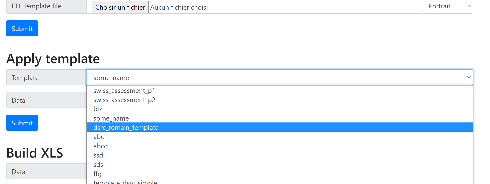

# Test-files-generator

## Reference Documentation

Project generating testing files for D-HUB application. 

The program takes invoices, trip details and payment requests csv and a mapping csv of EPR <-> EC1 IDs.
It updates the customers and sales partners IDs (EPR), replace them with EC1 IDs and create the new csv.

For the invoices, PDFs are also created using Pdf builder.
The output is located in the GENERATED_FILES folder.

### Usage
The folder with the program must be placed inside a "billrun" folder, containing the folders to process.

To launch the program click on the .bat script.

Csv should be in UTF-8.

You need to have access to Pdf builder to generate the PDFs and therefore being connected to vpn. 

### Using a different template
Go to [Pdf builder](http://doc-builder-t4e-ec1-ut.app.fx.mce.tcc.dc/api/build)
Upload a new template (in FTL format) and give it a name. If the name already exist, the new file will override the previous value.

Verify that your template is in the list.

### application.properties
* todo_dir : default is current dir
    * the path of the input dir
* processed_dir : default is "../GENERATED_FILES/"
    * the path of the output dir
* dsrc_template : default is dsrc_simple
  * the name of the template to apply to the invoices PDFs. 
  * it must be uploaded first on Pdf builder (see above)
* allowed_directories : default is "BE, DE, IT"
  * names of the invoices directories to process, separated with a ",".
* mapping_file_path : default is current folder
  * the location of the mapping csv
* pdf_builder_url : default is MCE
  * the url of pdf builder
  * DVI url is in comment
* app.csvConfig.columnSeparator : default is |
  * the column separator used in the csv
* app.csvConfig.quoteChar : default is "
  * the quote char used in the csv

